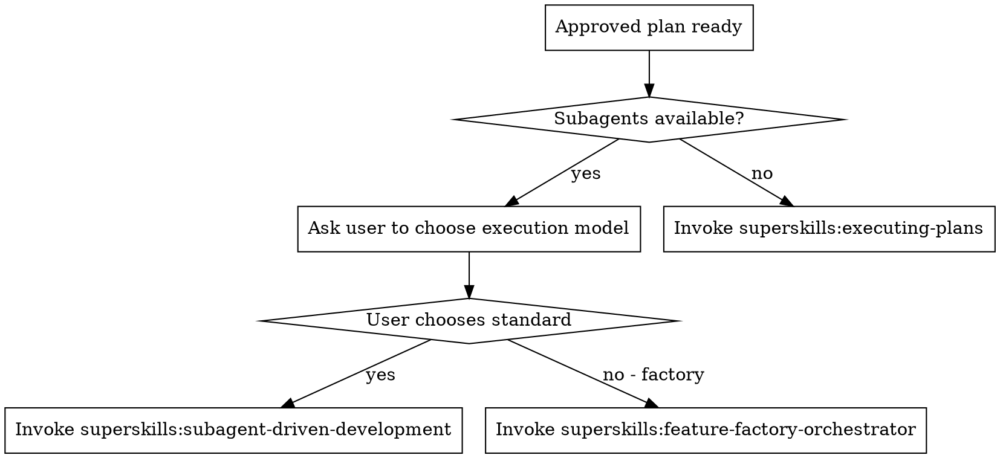

# Feature Factory Driven Development

Offer the user a choice of execution model after `superskills:writing-plans` produces an approved implementation plan. Route to the chosen model. Do not start implementation until the user chooses.

## When to Use

Use this skill immediately after a plan is approved and before any implementation begins. It is the decision point between standard Superskills execution and the feature factory pipeline.

## The Choice

Present the user with exactly two options:

1. **Standard Superskills execution.** A single subagent implements each task in the current session, with spec-compliance and code-quality review after every task. Best for focused changes where you want tight control and fast iteration.
2. **Feature Factory pipeline.** A coordinated pipeline that rewrites the plan into backend, frontend, and shared task groups, dispatches specialized builders and verifiers, and validates the result. Best for multi-layer features that benefit from role-specific agents.

Keep the explanation brief. The user already approved the plan; they only need enough context to pick a model.

## The Process

## Execution Rules

**If subagents are unavailable:**

- Do not present the choice.
- Fall back to `superskills:executing-plans`.
- Tell the user why the fallback happened.

**If the user chooses standard execution:**

- Invoke `superskills:subagent-driven-development`.
- Pass the approved plan and any relevant context.

**If the user chooses the feature factory pipeline:**

- Invoke `superskills:feature-factory-orchestrator`.
- Pass the approved plan unchanged.
- Let the orchestrator rewrite the plan into task groups.

## Hard Rules

**Never:**

- Start implementing before the user chooses a model.
- Present more than the two defined options.
- Default to one model without asking when subagents are available.
- Modify the approved plan before handing it to the chosen skill.
- Recommend a model based on personal preference; describe the trade-offs neutrally.

**Always:**

- Confirm subagent availability first.
- Route to `superskills:executing-plans` when subagents are unavailable.
- Pass the full approved plan to the chosen execution skill.
- Make the choice explicit in the session transcript.

## Integration

**Required workflow skills:**

- **superskills:writing-plans** — Produces the approved plan this skill acts on.
- **superskills:executing-plans** — Fallback when subagents are unavailable.
- **superskills:subagent-driven-development** — Standard same-session subagent execution.
- **superskills:feature-factory-orchestrator** — Coordinated pipeline execution.
