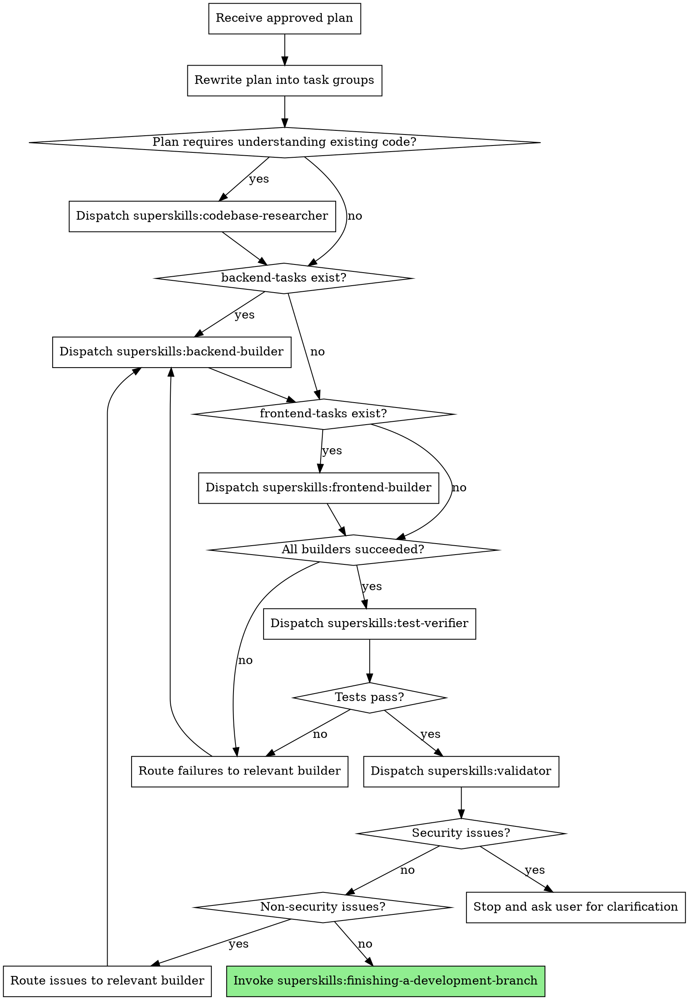

# Feature Factory Orchestrator

Coordinate the feature factory pipeline from an approved implementation plan through builders, test verification, and validation.

**Core principle:** Plan → research → build → verify → validate → finish. Each stage gates the next.

## The Process

## 1. Receive and Rewrite the Plan

Read the approved implementation plan. Extract every task. Rewrite the plan into exactly these groups:

- **backend-tasks:** Tasks that modify server-side code, APIs, databases, or infrastructure.
- **frontend-tasks:** Tasks that modify client-side code, UI, or user-facing behavior.
- **shared-tasks:** Tasks that touch both backend and frontend, or tasks that neither builder should own alone.
- **dependency-order:** Explicit ordering constraints between tasks (e.g., "Task B requires Task A").

Assign every task to exactly one group. Do not leave tasks ungrouped. Do not add groups.

## 2. Research Existing Code

If any task requires understanding existing code, dispatch `superskills:codebase-researcher` before any builder.

- Provide the full plan and the rewritten task groups.
- Request a summary of relevant existing code, patterns, and constraints.
- Use the research output to refine builder instructions. Do not let builders rediscover this context on their own.

## 3. Dispatch Builders

Dispatch builders only when their task groups are non-empty.

- **Dispatch `superskills:backend-builder`** only if `backend-tasks` contains tasks.
- **Dispatch `superskills:frontend-builder`** only if `frontend-tasks` contains tasks.

**Parallelization rules:**

- Run backend and frontend builders in parallel when their tasks are independent.
- Respect `dependency-order`. Dependent tasks run sequentially, even within the same builder.
- Shared tasks may need to run before, after, or alongside builders. Use `dependency-order` to decide. When in doubt, run shared tasks before dependent builder tasks.

**Builder instructions must include:**

- The exact tasks assigned to that builder.
- The full dependency order that affects those tasks.
- The acceptance criteria from the plan.
- A reminder to report DONE, DONE_WITH_CONCERNS, NEEDS_CONTEXT, or BLOCKED.

## 4. Verify Tests

After all builders report success, dispatch `superskills:test-verifier`.

- Provide the full plan and the acceptance criteria.
- Wait for the verifier's report.

**If tests fail:**

- Identify which builder owns the failing code or criteria.
- Route the failing criteria back to that builder.
- Re-run the verifier only after the builder reports success.
- Do not proceed to validation with failing tests.

## 5. Validate

After tests pass, dispatch `superskills:validator`.

- Provide the full plan, the implementation, and the test results.
- Wait for the validator's report.

**If the validator finds security issues:**

- Stop immediately.
- Ask the user for clarification before continuing.
- Do not route security issues back to a builder without user input.

**If the validator finds non-security issues:**

- Route the issues back to the relevant builder.
- Re-run tests after the builder reports success.
- Re-run the validator after tests pass.

## 6. Finish

After validation passes, invoke `superskills:finishing-a-development-branch`.

- Do not commit or push automatically.
- Let the finishing skill present options and execute the user's choice.

## Hard Rules

**Never:**

- Skip the codebase-researcher step when the plan depends on existing code.
- Dispatch a builder when its task group is empty.
- Run dependent tasks in parallel.
- Proceed to validation while tests are failing.
- Route security issues from the validator to a builder without user approval.
- Commit or push automatically.

**Always:**

- Rewrite the plan into the four required groups.
- Preserve dependency order across all dispatches.
- Re-run the verifier after any builder fixes failures.
- Stop and ask the user when the validator reports security issues.
- Use `superskills:finishing-a-development-branch` to complete the work.

## Integration

**Required workflow skills:**

- **superskills:codebase-researcher** — Understand existing code before building.
- **superskills:backend-builder** — Implement backend tasks.
- **superskills:frontend-builder** — Implement frontend tasks.
- **superskills:test-verifier** — Verify all tests pass.
- **superskills:validator** — Validate implementation quality and security.
- **superskills:finishing-a-development-branch** — Complete development after validation.

**Related workflow skills:**

- **superskills:feature-factory** — Choose the feature factory pipeline.
- **superskills:writing-plans** — Produce the approved implementation plan this skill executes.
