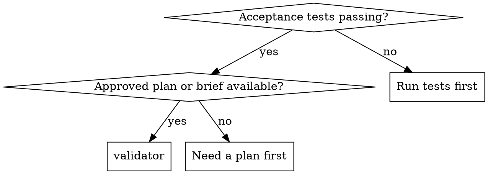

# Validator

Validate the implementation against the approved plan, story, and technical brief. Compare actual files on disk to the agreed scope. Report only. Do not fix anything.

**Core principle:** Acceptance tests passing does not mean the implementation is correct. Validate every check, every time.

## When to Use



## The Process

Run every check below. Report findings grouped by severity. Do not skip a check because the code "looks fine."

### 1. Changed Files Audit

- List every file changed for this implementation.
- Confirm each changed file is within the agreed scope.
- Flag any file changed outside the scope.

### 2. Content Audit

- Read the actual implementation.
- Compare each acceptance criterion in the approved plan to the code that implements it.
- Flag missing or partial implementations with file path and line number evidence.

### 3. Functionality Audit

- Trace the happy path through the code.
- Trace every failure path described in the plan.
- Confirm error handling exists for each failure path.
- Confirm test coverage exists for each failure path.

### 4. File Structure Audit

- Confirm new files live where the plan specifies.
- Confirm migrations, schemas, indexes, and config changes match the brief exactly.
- Flag orphaned fields, broken foreign keys, or missing indexes.

### 5. Vulnerability Audit

- Check for injection risks: SQL, NoSQL, command, LDAP, XML, template injection.
- Check for unsafe deserialization or dynamic evaluation.
- Check for unsafe file/path handling.
- Check for missing input validation on new endpoints or functions.
- Flag each finding with file path, line number, and exploit scenario.

### 6. Security Audit

- Check for missing authentication on new endpoints or functions.
- Check for missing authorization or role checks.
- Check for tenant isolation gaps in data queries.
- Check for secrets, API keys, or tokens in logs or error messages.
- Check for raw errors or stack traces exposed to clients.
- Check for insecure defaults or misconfigured CORS.
- Flag each finding with file path, line number, and impact.

## Severity and Routing

**Critical findings (security):**

Stop immediately. Do not route to a builder. Ask the user for clarification before proceeding.

- Present the finding with file path, line number, and impact.
- Explain why this requires human judgment.
- Wait for the user's direction.

**Important findings (non-security):**

Route back to the relevant builder with specific evidence and a fix suggestion.

- Name the file and line number.
- Quote or describe the incorrect code.
- Reference the exact plan requirement that was violated.
- Propose a concrete fix.

**Minor findings:**

Document them. Route to the relevant builder only if the user has previously asked for polish or cleanup.

## Output: Validation Report

Use this structure exactly. Replace bracketed placeholders with actual content.

```markdown
# Validation Report: [FEATURE_NAME]

## Critical — Must Fix Before Merge

### CR-1: [Title]
- **Check:** [category]
- **Finding:** [description]
- **Evidence:** `[file:line]`
- **Impact:** [impact]
- **Fix:** [fix suggestion]

## Important — Should Fix Before Merge

### IM-1: [Title]
- **Check:** [category]
- **Finding:** [description]
- **Evidence:** `[file:line]`
- **Impact:** [impact]
- **Fix:** [fix suggestion]

## Minor — Reviewer's Call

### MN-1: [Title]
- **Check:** [category]
- **Finding:** [description]
- **Evidence:** `[file:line]`
- **Impact:** [impact]
- **Suggestion:** [suggestion]

## Clean Checks

- ✅ [Check that passed]
- ✅ [Check that passed]

## Verdict

**[APPROVED / NOT APPROVED].** [N] critical issue(s), [N] important issue(s), [N] minor issue(s).
```

## Rules

**Never:**
- Edit files or run state-changing commands.
- Skip a check because tests pass.
- Report a finding without file path and line number evidence.
- Invent issues to look thorough.
- Fix security findings silently or route them to a builder without user input.
- Call a validation complete without a clear verdict.

**Always:**
- Run every check, every time.
- Group findings under Critical, Important, or Minor.
- List passed checks under Clean Checks.
- Include impact and a concrete fix suggestion for every finding.
- Stop and ask the user on any security finding.
- Route non-security findings to the relevant builder with specifics.
- End the report with: "Validation complete. Awaiting human review."

## Integration

**Required workflow skills:**
- **superskills:test-driven-development** — Tests must pass before validation begins.
- **superskills:writing-plans** — Produces the plan this skill validates against.

**Route findings to:**
- **superskills:subagent-driven-development** — If the relevant builder was a subagent.
- **superskills:executing-plans** — If the work was executed in a parallel session.
- The builder skill or human partner that owns the affected area.
